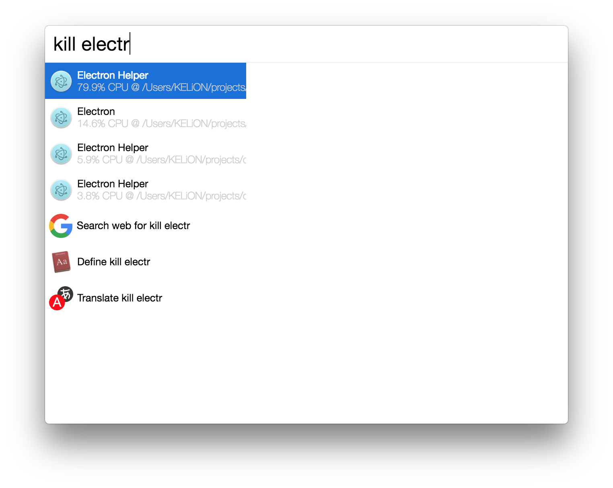

# cerebro-kill

> [Cerebro](http://www.cerebroapp.com) plugin to kill process by name

## Usage

In Cerebro, type `kill something` to find your process, like `kill electron`. Use <kbd>↩</kbd> to kill selected process.

## Related

- [Cerebro](http://github.com/KELiON/cerebro) – main repo for Cerebro app;
- [cerebro-plugin](https://github.com/KELiON/cerebro-plugin) – boilerplate to create plugins for Cerebro app

## License

MIT © [Alexandr Subbotin](http://asubbotin.ru)
